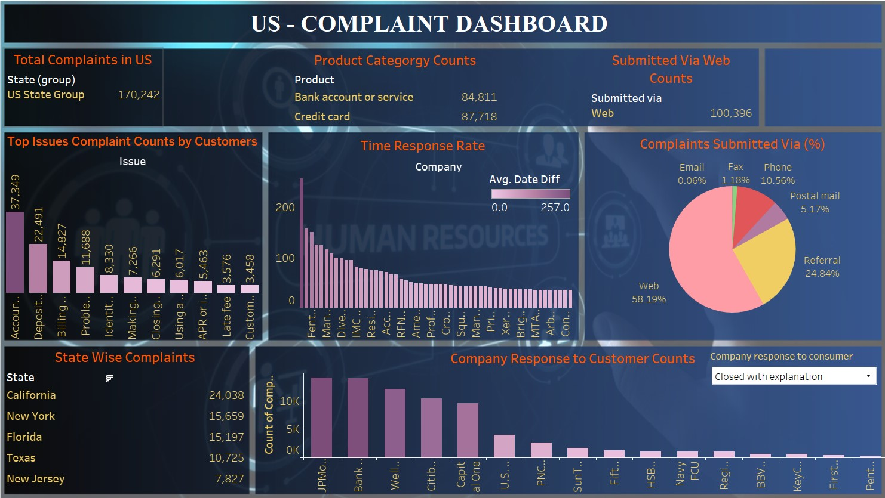

# US Complaints Dashboard

## Screenshot | [Live Project Link](https://public.tableau.com/views/USComplaintsDashboard/Dashboard1?:language=en-US&:sid=&:redirect=auth&:display_count=n&:origin=viz_share_link)

## Overview

Welcome to the US Complaints Dashboard! 📊 This dashboard offers interactive visualizations and insights into consumer complaints filed against companies in the United States. It is designed using Tableau to provide an intuitive and comprehensive user experience.

## Features

- **Interactive Data Visualizations:** Explore trends and patterns in consumer complaints through dynamic visualizations.
- **Filter and Drill Down:** Utilize filters to investigate complaints by company, product, issue, state, and more.
- **User-Friendly Interface:** Designed for ease of navigation and accessibility, accommodating users with varying levels of data literacy.

## Technologies Used

- **Tableau:** Powering the interactive and responsive dashboard interface.
- **Complaints Dataset:** Utilizing a comprehensive dataset containing consumer complaint data across various dimensions.
- **Visualization:** Leveraging Tableau's robust capabilities to create informative charts and graphs.

## Getting Started

### Prerequisites

- Access to Tableau Public or Tableau Desktop for viewing and interacting with the dashboard.

### Accessing the Dashboard

1. Visit the Tableau Public link or download the Tableau Workbook (.twbx file) from the repository.
2. Open the dashboard in Tableau Public or Tableau Desktop.
3. Interact with the filters and visualizations to explore different aspects of consumer complaints.

## Explore the Dashboard

1. **Filter by Dimensions:** Use filters to view complaints by company, product, state, and other relevant dimensions.
2. **Trend Analysis:** Analyze trends over time and compare complaint volumes between different categories.
3. **Insight Discovery:** Gain insights into common issues reported by consumers and companies' responses

## Findings

Upon analyzing the data, several insights were found:

- **Top Complaint Categories:** Issues related to account management and service are frequently reported.
- **Geographical Patterns:** Complaint volumes vary significantly across states, with some regions experiencing higher complaint rates.
- **Company Response:** Many complaints are resolved with explanations, indicating proactive responses from companies.

## Contributing

If you have suggestions for improving the dashboard or additional features to include, please feel free to fork the repository and submit a pull request. 🚀

## License

This project is available under the MIT License.

## Acknowledgments

Special thanks to Tableau for providing powerful tools to visualize and analyze data effectively. 🙌
